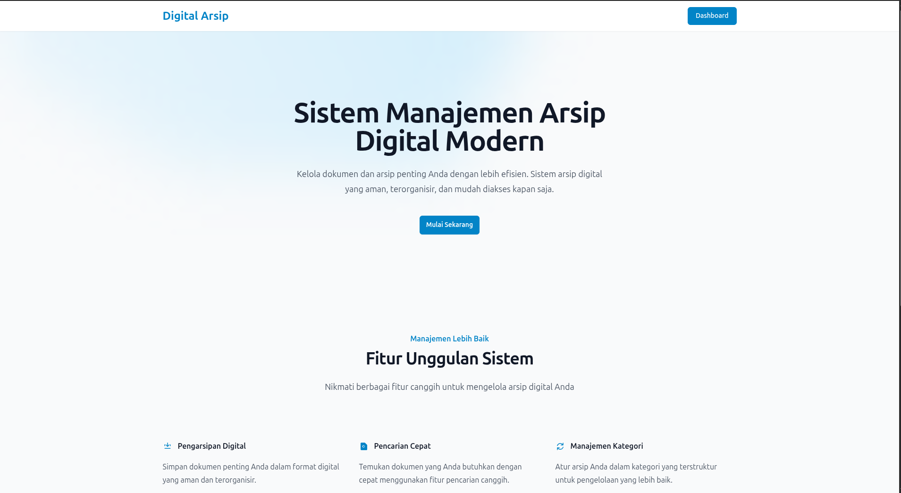

# Digital Arsip



## Tentang Proyek

Digital Arsip adalah aplikasi web yang dibangun dengan Laravel 10 untuk manajemen arsip digital modern. Aplikasi ini menggunakan Filament 3 sebagai admin panel, yang menyediakan antarmuka yang kaya dan reaktif untuk mengelola arsip. Pengguna dapat mengunggah, mengkategorikan, dan mengelola file digital dengan mudah. Aplikasi ini juga dilengkapi dengan kontrol akses berbasis peran (role-based access control) yang didukung oleh `bezhansalleh/filament-shield`.

Frontend aplikasi ini dibangun menggunakan Vite dengan Tailwind CSS untuk styling.

## Fitur Utama

*   **Manajemen Arsip:** Unggah, lihat, edit, dan hapus arsip digital.
*   **Kategorisasi:** Kelola arsip dengan mengelompokkannya ke dalam kategori.
*   **Pencarian Cepat:** Temukan arsip dengan cepat melalui fitur pencarian.
*   **Manajemen Pengguna:** Kelola pengguna dan peran (roles).
*   **Kontrol Akses:** Batasi akses ke fitur-fitur tertentu berdasarkan peran pengguna.

## Teknologi yang Digunakan

*   **Backend:** PHP 8.1, Laravel 10
*   **Admin Panel:** Filament 3
*   **Frontend:** Vite, Tailwind CSS
*   **Database:** MySQL/PostgreSQL (atau database lain yang didukung Laravel)

## Instalasi dan Konfigurasi Lokal

Berikut adalah langkah-langkah untuk menjalankan proyek ini di lingkungan lokal Anda:

1.  **Clone Repositori:**
    ```bash
    git clone https://github.com/username/digital-arsip.git
    cd digital-arsip
    ```

2.  **Install Dependensi:**
    *   Install dependensi PHP dengan Composer:
        ```bash
        composer install
        ```
    *   Install dependensi frontend dengan NPM:
        ```bash
        npm install
        ```

3.  **Konfigurasi Environment:**
    *   Salin file `.env.example` menjadi `.env`:
        ```bash
        cp .env.example .env
        ```
    *   Buat kunci aplikasi baru:
        ```bash
        php artisan key:generate
        ```
    *   Konfigurasikan koneksi database Anda di dalam file `.env` (DB_CONNECTION, DB_HOST, DB_PORT, DB_DATABASE, DB_USERNAME, DB_PASSWORD).

4.  **Migrasi Database:**
    *   Jalankan migrasi untuk membuat tabel-tabel yang diperlukan di database:
        ```bash
        php artisan migrate
        ```

5.  **Symbolic Link untuk Storage:**
    *   Buat symbolic link agar file yang diunggah dapat diakses dari web:
        ```bash
        php artisan storage:link
        ```

6.  **Jalankan Aplikasi:**
    *   Jalankan server development PHP:
        ```bash
        php artisan serve
        ```
    *   Jalankan server development Vite untuk aset frontend:
        ```bash
        npm run dev
        ```
    *   Aplikasi sekarang dapat diakses di `http://localhost:8000`.

## Manajemen Pengguna dan Peran

Aplikasi ini menggunakan `bezhansalleh/filament-shield` untuk manajemen peran dan izin.

### Membuat Super Admin

Untuk membuat pengguna dengan peran Super Admin, jalankan perintah Artisan berikut dan ikuti prompt yang muncul:

```bash
php artisan shield:super-admin

php artisan shield:generate --panel=admin --all --option=policies_and_permissions -n
```

Setelah itu, Anda dapat login menggunakan email dan password yang telah Anda buat untuk mengakses semua fitur aplikasi.

### Membuat Pengguna Baru

Pengguna baru dapat dibuat melalui antarmuka admin panel oleh Super Admin atau pengguna lain yang memiliki izin.

1.  Login sebagai Super Admin.
2.  Navigasi ke menu "Users".
3.  Klik tombol "New User".
4.  Isi formulir dengan data pengguna baru.
5.  Anda juga dapat menetapkan peran (role) untuk pengguna tersebut saat membuatnya.
